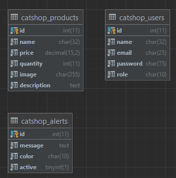

# **Functional design Catshop**
| Info | |  
| ----------- | ----------- |
| **Version** | 1.0 |  
| **Date** | 23/06/2022 |  
| **Name** | Twan van Paridon |
| **Student ID** | 157802 |

# **Index**
### [**Functionalities**](##unctionalities)
##### [**Home-page**](#Functionalities)
##### [**Product-page**](#Functionalities)
##### [**File-page**](#Functionalities)
##### [**Alert-page**](#Functionalities)
##### [**Admin-page**](#Functionalities)
#### [**Components**](#Functionalities)
##### [**Nav bar**](#Functionalities)
##### [**Alerts**](#Functionalities)
---
### [**Functions**](#Functionalities)
##### [**Roles**](#Functionalities)
##### [**Account info**](#Functionalities)
---
### [**Datamodel**](#Functionalities)
##### [**E.R.D**](#Functionalities)
##### [**Data dictionary**](#Functionalities)
---
### [**Production environment**](#Functionalities)
##### [**Server Programs**](#Functionalities)
##### [**Open ports**](#Functionalities)
##### [**Server installation steps**](#Functionalities)

 

---
## **Functionalities**
### **Home-page**
**Requirements**
The following is required:
- Serve as a landing page.
- have a welcome message. 

---

### **Product-page**
**Requirements**
The following is required:

- The product page should serve products to the user.
- The product page should have a search function

**Style**
The product page should have a grid of images with a title, price and discription.
For this can be use a bootstrap card. Above the grid there should be a search bar for searching products. After searching a product there should be a text displaying what you have searched.

**Security**
The Search function should be sql-injection safe, This can be done by using PDO protocol. The text displaying your search query be safe from XSS by only printing text instead of a executing code. This can be done with the following code:
`echo htmlentities($str);`

 

---
### **File-page**
**Requirements**
The following is required:
- Display files in table
- Upload files
- Download files

**Style**
The files should be dispayed in a bootstrap table and should have the following columns:

| id | Name | Tools | 
| ----------- | ----------- | ----------- | 
| 1 | example.jpg |Download, Delete ***(Icons)***|

 

There should also be a action above the table to add files.

When deleting a file there should be a bootstrap modal confirming your action. After deleting the file there should be a alert showing the satus of deleting the file.

When adding a file there should be a bootstrap modal containing the functionality to upload a file.

**Security**
When uploading a file it should be checked for file size and extention. this need to be under 5mb and one of the following extentions:
-  .jpg
-  .jpeg  
-  .png
-  .gif
-  .txt

When *downloading/deleting* a file it should be containt to the 'File' directory. The user should not be able to *download/deleting* files out side of the given directory. This can be done by using the following function `basename($path);`.

 

---
### **Alert-page**
**Requirements**
The following is required:
- The page should have a way to display all alerts.
- Update alerts
- Delete alerts
- Activate/deactivate alerts
- Create new alerts

**Style**
The files should be dispayed in a bootstrap table and should have the following columns:

| id | Message | Color | Active | Tools | 
| ----------- | ----------- | ----------- | ----------- | ----------- |
| 1 | example message | $color | Active | Activate, Update, Delete ***(Icons)***|

 

There should also be a action above the table to add alerts and disable all alerts.

When activating, deactivating and deleting a alert there should be a bootstrap modal confirming your action.

When adding and updating a alert there should be a bootstrap modal containing the form for the message and color.
**Security**
There can only be one alert active at a time.

When displaying the alert you should be conscious of XSS vulnerabilities.
[See alerts](####alerts)

 

---
### **Admin-page**
**Requirements**
The following is required:
- Display all users
- Change user roles
- Delete users

**Style**
The users should be dispayed in a bootstrap table and should have the following columns:

| id | Email | Name | Role | Tools | 
| ----------- | ----------- | ----------- | ----------- | ----------- |
| 1 | Examle@email.com | Example Name | $role | Update, Delete ***(Icons)***|

 

When deleting a user there should be a bootstrap modal confirming your action.
When updating a user there should be a bootstrap modal containing the form for the role.

**Security**
You should only partially retrieve the userdata, so no information will be leaked.

### **Components**
#### **Nav bar**
The nav-bar contains the following items:
- Home
- Products
- Files
- Alerts
- $userName/Login
	- User settings
	- Admin page
	- logout

The user role should be check to accordingly display the nav items.
If the user role does not check the needed permision, than the item should not be displayed.

When displaying the username you should be conscious of XSS use the following code to prevent XSS `echo htmlentities($str);`.

 

---
#### **Alerts**
The alerts should be displayed on the Home page and the Product page under the nav-bar.

This should be a bootstrap alert with the given color an the message. The message should be XSS safe by using the following code `echo htmlentities($str);`.

 

---
### **Functions**
#### **Roles**
The role system is set in place so the user can't access all parts of the website.

There are the following roles:
- user  
- admin  
- superadmin

**Security**  
When a user does not have access to a page the user should be redirected to the home page. The contents of the pages should also not be loaded in for the user.

The roles have access to the following pages:

| Pages | Guest | User | Admin | Super Admin |  
| ----------- | ----------- |  ----------- | ----------- | ----------- | 
| **Home** | ✅ |  ✅ |  ✅ | ✅ |
| **Products** | ✅ |  ✅ |  ✅ | ✅ |
| **Files** | ❌ |  ❌ |  ➖ | ✅ |
| **Alerts** | ❌ |  ❌ |  ❌ | ✅ |
| **User** | ❌ |  ✅ |  ✅ | ✅ |
| **Admin** | ❌ |  ❌ |  ❌ | ✅ |

>Icon definitions
✅  : Full access
❌  : No access
➖  : Partial access

 

#### **Account info**

It's important the accounts create are safe. Thats why a account be validated on creation.

The user name is validated on the following properties:
- Between 4 and 32 chars
- Must not contain special chars as following:
	- `;`, `#`, `<`, `>`, `?`, `/`, `\`

The user email should be validated as a real email.
 
The user password is validated on the following properties:
- Must be longer than 8 chars
- Must contain a special char
- Must contain a capital letter
- Must contain a small letter
- Must contain a number

When saving the password it should be encrypted with a one way hash like bcrypt. This way it much safer.

 

---
## **Datamodel**
### **E.R.D**

 

---
### **Data dictionary**
**Catshop-Products**

| Column | Datatype | Length | Key | Relation |  
| ----------- | ----------- |  ----------- | ----------- | ----------- |
| Id | int | 11 | Primary |- |
| name | char | 32 | - | - |
| price | decimal | 15,2 | - | - |
| quantity | int | 11 |- | - |
| image | char | 255 | - | - |
| description | text | - | - | - |

***

**Catshop-Alerts**

| Column | Datatype | Length | Key | Relation |  
| ----------- | ----------- |  ----------- | ----------- | ----------- |
| Id | int | 11 | Primary |- |
| message | text | - | - | - |
| color | char | 10 | - | - |
| active | tinyint | 1 | - | - |

***

**Catshop-Products**

| Column | Datatype | Length | Key | Relation |  
| ----------- | ----------- |  ----------- | ----------- | ----------- |
| Id | int | 11 | Primary |- |
| name | char | 32 | - | - |
| email | char | 25 | Secondary | - |
| password | char | 75 |- | - |
| role | char | 10 | - | - |

 

---
## Production environment

#### **Server Programs**

| Program | Version |  
| ----------- | ----------- |  
| Ubuntu | 21.04 |  
| Apache2 | 2.4.46 |
| PHP | 8.1.7 |
| MySQL | 8.0.29 |
| UFW | 0.36-7 |

***

#### **Open ports**
all ports are managed by UFW
- Port 80 for apache2
- Port 22 for Open SHH

***
#### **Server installation steps**

Installing apache2
1.  `sudo apt install apache2`
2. `sudo ufw allow 'Apache'`
3. `sudo ufw allow 'OpenSSH'`
4. `sudo cp /etc/apache2/sites-available/000-default.conf /etc/apache2/sites-available/mynewsite.conf`
5. `sudo a2ensite mynewsite`
6. `sudo systemctl restart apache2.service`

***
Installing PHP
1. `sudo apt install php8.0`
2. `sudo apt install php8.0-cli php8.0-common php8.0-imap php8.0-redis php8.0-snmp php8.0-xml php8.0-zip php8.0-mbstring php8.0-mysql`
3. `sudo systemctl restart apache2`

***
Installing MySQL
1. `sudo apt install mysql-server`
2. `sudo systemctl start mysql.service`
3. `sudo mysql_secure_installation`
4. `sudo use mysql`
5. `ALTER USER  'root'@'localhost' IDENTIFIED BY '$NewPassword';`
6. `quit`